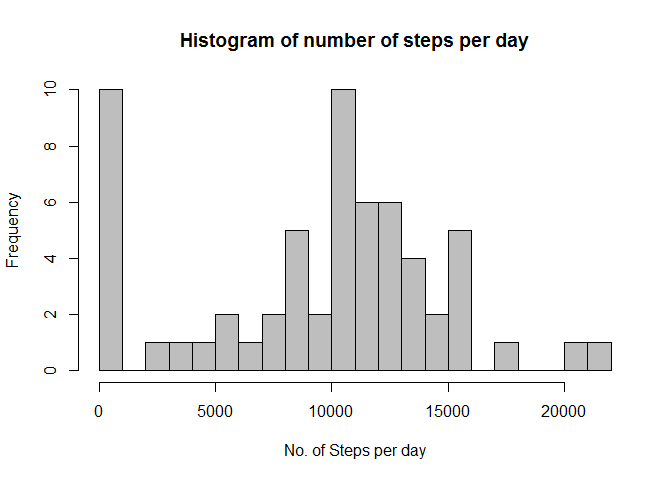
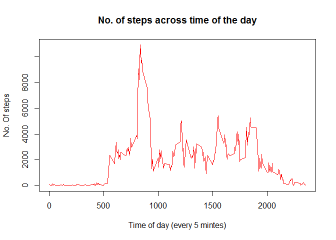
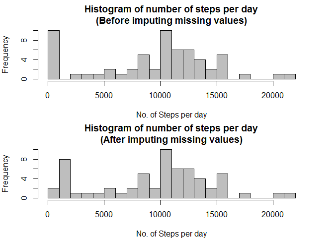
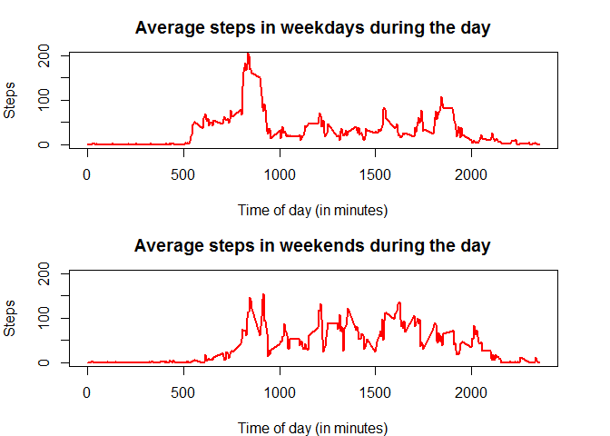

# Reproducible Research - Assignment No. 1
July 17, 2015  

This document is prepared as a submission for Assignment No. 1 of the course Reproducible Research.  

## Loading and preprocessing the data

It is a good practice to set the working directory so that all files related to this assignment are contained together. This is followed by loading the data. 


```r
setwd("C:/Users/Filly/Documents/Reproducible_Research_Assignment_No.1") 
library(data.table)
```

```
## Warning: package 'data.table' was built under R version 3.1.3
```

```r
data <- read.table("activity.csv", header=T, sep = ",")
data <- data.table(data)  ## converts the dataframe into a datatable
```

In the data, variable date has to be transformed into a time/day format which is recognized by R.


```r
data$date <- as.Date(data$date)
```

To have a general understanding of the the data that I will be working, I always prefer to view the first few rows of the data. This also makes sure that the data is properly read. A summary statistics of the variables also provide further preliminary understanding of the data.


```r
head(data)
summary(data)
```

```
##    steps       date interval
## 1:    NA 2012-10-01        0
## 2:    NA 2012-10-01        5
## 3:    NA 2012-10-01       10
## 4:    NA 2012-10-01       15
## 5:    NA 2012-10-01       20
## 6:    NA 2012-10-01       25
##      steps             date               interval     
##  Min.   :  0.00   Min.   :2012-10-01   Min.   :   0.0  
##  1st Qu.:  0.00   1st Qu.:2012-10-16   1st Qu.: 588.8  
##  Median :  0.00   Median :2012-10-31   Median :1177.5  
##  Mean   : 37.38   Mean   :2012-10-31   Mean   :1177.5  
##  3rd Qu.: 12.00   3rd Qu.:2012-11-15   3rd Qu.:1766.2  
##  Max.   :806.00   Max.   :2012-11-30   Max.   :2355.0  
##  NA's   :2304
```

## What is mean total number of steps taken per day?

The histogram of the number of steps taken per day can be plotted using the following code:


```r
StepsPerDay <- data[,sum(steps, na.rm = T), by='date']

hist(StepsPerDay$V1, breaks=seq(0,(max(StepsPerDay$V1)+1000),1000), xlab="No. of Steps per day", main = "Histogram of number of steps per day", col=8)
```

 

The mean number of steps taken per day can be obtained by passing the following code:


```r
MeanStepsPerDay <- round(mean(StepsPerDay$V1), digit=0)
MeanStepsPerDay

MedianStepsPerDay <- round(median(StepsPerDay$V1), digit=0)
MedianStepsPerDay
```

```
## [1] 9354
## [1] 10395
```

The mean and median steps per day were found to be 9354 and 1.0395\times 10^{4} respectively.

## What is the average daily activity pattern?

To figure out the average daily activity pattern, number of steps were aggregated at every 5 minute intervals across all the days. This following code does this:


```r
StepsEvery5minutes <- data[,sum(steps, na.rm = T), by='interval'] 

plot(StepsEvery5minutes$interval, StepsEvery5minutes$V1, type="l", col=2, xlab="Time of day (every 5 mintes)", ylab="No. Of steps", main="No. of steps across time of the day")
```

 

```r
MaxSteps <- max(StepsEvery5minutes$V1)
MaxSteps

TimeIntervalMaxSteps <- which(StepsEvery5minutes$V1 == MaxSteps)
TimeIntervalMaxSteps
```

```
## [1] 10927
## [1] 104
```

Therefore, the average maximum number of steps taken in 5 minutes across all the days was found to be 10927 and this happened at the 104 of the 5 minute intervals from the midnight, i.e., 8:40 AM.

## Imputing missing values

The following code reveals the number of missing values and imputes them with average of steps in their respective intervals.


```r
NoOfRowsContainingNAs <- sum(is.na(data))
NoOfRowsContainingNAs

NewData <- data
NewData <- NewData[,MedianSteps:=median(steps, na.rm = T), by='interval']
NewData$steps[which(is.na(NewData$steps)==TRUE)] <- NewData$MedianSteps[which(is.na(NewData$steps)==TRUE)]
```

```
## [1] 2304
```

In the data set, there were 2304 rows with incomplete information. 

## Are there differences in activity patterns between weekdays and weekends?

There is considerable amount of missing values in the data set and therefore they need to be imputed using appropriate meathod. In this work, all missing values are imputed the median value of the corresponding time interval.After imputing the missing values, we need to check if the mean and median of the steps change or not. The following code does this:


```r
par(mfrow=c(2,1))
par(mar=c(4,4,3,3))

hist(StepsPerDay$V1, breaks=seq(0,(max(StepsPerDay$V1)+1000),1000), xlab="No. of Steps per day", main = "Histogram of number of steps per day\n(Before imputing missing values)", col=8)

NewStepsPerDay <- NewData[,sum(steps, na.rm = T), by='date'] 
hist(NewStepsPerDay$V1, breaks=seq(0,(max(NewStepsPerDay$V1)+1000),1000), xlab="No. of Steps per day", main = paste("Histogram of number of steps per day\n(After imputing missing values)"), col=8)
```

 

```r
NewMeanStepsPerDay <- round(mean(NewStepsPerDay$V1), digit=0)
NewMeanStepsPerDay

NewMedianStepsPerDay <- round(median(NewStepsPerDay$V1), digit=0)
NewMedianStepsPerDay
```

```
## [1] 9504
## [1] 10395
```

Before imputing the missing values, the mean and median steps per day were 9354 and 1.0395\times 10^{4}, respectively. After imputing the missing values, were found to be 9504 and 1.0395\times 10^{4}, respectively. As a result of the imputation process, the mean steps per day increased by 150 while the median remained constant. Also to see the significance of this change, some kind of t-test should be applied. 

It has to be noted that the change in mean/median of the steps per day might differ depending on how the missing values were imputed. 

## Are there differences in activity patterns between weekdays and weekends?

As shown in the figures below, there is a significant difference in the activity patterns between weekdays and weekends. The following can be concluded from the plots:

1. The maximum average number of steps during the weekdays is higher than the maximum average number of steps during weekends. 

2. The peak of the average steps during weekdays is concentrated in morning hours around 8AM, probably going to work. 

3. The peak of the average number of steps during weekends is spread from late morning to late evening hours. 

4. The plots also reveals that people start to be active late in the morning and stay active until late in the evenining during weekends compared to weekdays.


```r
DayOfWeek <- weekdays(data$date)

WeekDays <- c("Monday","Tuesday","Wednesday","Thursday","Friday")
WeekEnds <- c("Saturday","Sunday")

DayOfWeek[DayOfWeek %in% WeekDays] <- "weekday"
DayOfWeek[DayOfWeek %in% WeekEnds] <- "weekend"

NewData$DayOfWeek <- DayOfWeek

StepsInWeekDays <- NewData[NewData$DayOfWeek == "weekday",]

StepsInWeekEnds <- NewData[NewData$DayOfWeek == "weekend",]

AverageStepsWeekDays <- StepsInWeekDays[,list(DayOfWeek, mean(steps)), by='interval']

AverageStepsWeekEnds <- StepsInWeekEnds[,list(DayOfWeek, mean(steps)), by='interval']

par(mfrow=c(2,1))
par(mar=c(4,4,3,3))

plot(AverageStepsWeekDays$interval, AverageStepsWeekDays$V2, typ='l', lwd=2, col=2, xlab="Time of day (in minutes)", ylab = "Steps", main = "Average steps in weekdays during the day", ylim=c(0,200))

plot(AverageStepsWeekEnds$interval, AverageStepsWeekEnds$V2, typ='l', lwd=2, col=2, xlab="Time of day (in minutes)", ylab = "Steps", main = "Average steps in weekends during the day", ylim=c(0,200))
```

 

